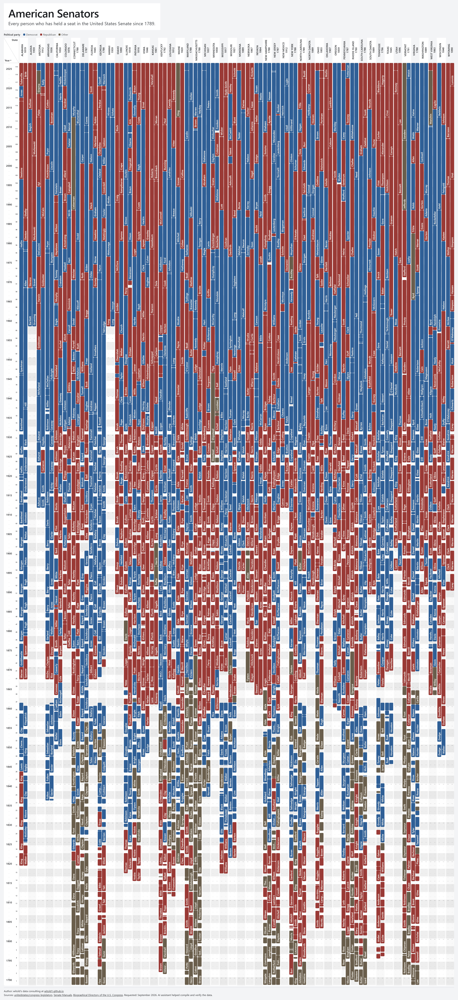
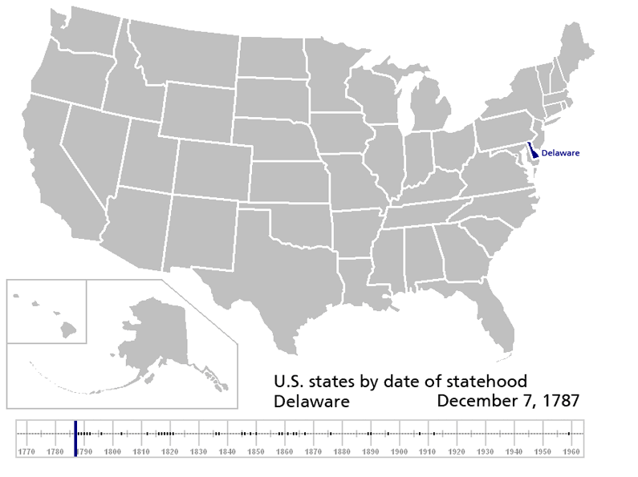

# American Senators Timeline

[](https://witold1.github.io/american-senators-timeline/)<br>


<br>

<br>


Interactive timeline of United States Senators (federal senators) from the 1st United States Congress (1789) to the present day. See the tenure of senators from confirmation date (*with many legal details) to departure. Inspired by [The Supreme Court has had 116 justices. Here's who put them there](https://usafacts.org/articles/the-viz-lab/supreme-court-tenure/) by USAFacts.

## Description

<p align="center">
  
</p>

### 1. Layers

| Element | Meaning |
|---------|---------|
| Colored bars | Senators on that seat (color by party) |

Hover bars for names, party, dates, and time served. Click a bar to copy the senator's name.

### 2. Controls

The chart bar holds search, sorting, color, orientation, Save image (SVG or PNG), and the settings gear. Theme sits above the title.

Settings panel:

- **Show term bars** / **Show senator names** / **Last names only** / **Name colors match bars**
- **Show admission year** / **Show region filter** / **Show Congress numbers** / **Color historic parties**
- **Palette**: Muted / Soft / Vivid

Each toggle has a tooltip describing what it changes.

## Data

<p align="center">
  
</p>

A Congress is a two-year period, while a senator's normal term lasts six years, so one Senate term can span several Congresses. Each state has two Senate seats, and each seat belongs to one of three classes (Class 1, Class 2, or Class 3). The class determines the seat's place in the Senate's staggered six-year election cycle; it does not describe the senator personally. When one senator replaces another, they normally continue to occupy the same seat and class. A senator does not leave office when a Congress ends; for example, James Mason remained a senator across several Congresses until he left the Senate in 1861. Congress itself can also have several sessions, with recesses between them, but those recesses do not interrupt a senator's service. The confusing part is that being elected does not always mean immediately serving: someone elected for a future term can be called a senator-elect until the new term begins. Likewise, someone appointed to a vacancy can begin serving before the next regular election. If a senator leaves early, the seat becomes vacant, and another person may be appointed to fill the vacancy and later elected to fill the unexpired term. Nathan Farwell is an example: he was appointed after William P. Fessenden resigned, then elected by the Maine legislature to continue the same unexpired term. He therefore had two periods with different legal bases—appointed and elected—but did not serve two separate Senate terms.

There are several other reasons a historical senator's timeline can have gaps or unusual transitions. A state may not yet have been admitted to the Union, a Senate seat may remain vacant because an election was delayed or a legislature failed to elect someone, or an election may be contested, meaning the apparent winner is not immediately seated. A senator-designate generally refers to someone appointed or selected but not yet fully qualified or seated. On the other hand, recesses, adjournments, and the end of a Congress do not create gaps in a senator's service. Before the 20th Amendment, this was particularly confusing because a new Congress formally began on March 4, while its regular session often did not begin until much later. Thus, when reading a historical Senate timeline, it is useful to distinguish states, Senate seats and classes, Congresses and sessions, Senate terms, actual service dates, elections, appointments, vacancies, and seating rather than treating every Congress boundary as a change of senator.

Dataset layers under `data/`:

- `raw/` - congress-legislators YAML, saved as downloaded
- `auxiliary/` - Senate Manual service table and timeline bounds
- `processed/` - chart files the page fetches: `seats-all.json` and `seats/{id}.json` (order from `seats/index.json`)

Per-seat fields: `state`, `class`, `region`, and `rulers` (senator spans). Schema notes live in [`data/README.md`](data/README.md).

Seat JSON is generated from [unitedstates/congress-legislators](https://github.com/unitedstates/congress-legislators). Overlapping spans are checked against the [Senate Manual, 104th Congress](https://www.govinfo.gov/content/pkg/SMAN-104/html/SMAN-104-pg961.htm):

```powershell
pip install -r scripts/requirements.txt
python scripts/import_senators.py
```

## Run locally

Preferred: run a local server, then open the URL it prints. The page loads seats from `data/processed/` and timeline bounds from `data/auxiliary/meta.json`.

```powershell
.\serve.ps1
```

Or: `python -m http.server 8080`

Opening `index.html` via `file://` will not load data (browsers block local `fetch`). Use the server above or host on GitHub Pages.

## Repository layout

```text
index.html         Page shell
serve.ps1          Local static server (Windows)
scripts/
  import_senators.py   raw YAML + auxiliary manual → processed seat JSON
css/
  themes.css           Tokens, light/dark, palette presets
  layout.css           Reset, header, settings, footer, responsive
  chrome.css           Filters, chips, export, legend
  chart.css            Axis, state groups, bars (vertical)
  chart-horizontal.css Horizontal orientation overrides
  overlay.css          Tooltip + debug panel
js/
  load.js              Fetches JSON at runtime
  theme.js             Theme switcher
  export.js            PNG and SVG export (lazy-loads html-to-image)
  palette.js           Party / person bar colors
  geometry.js          Year→pixel mapping + layout metrics
  labels.js            Name formatting + bar labels
  interaction.js       Tooltips; click copies the senator name
  filters.js           Filter state + search
  controls.js          Settings panel + display toggles
  filter-controls.js   Chip filters (order, region, …)
  render.js            Timeline DOM (rows, bars)
  app.js               Boot glue (init + resize/theme hooks)
  debug.js             Environment info (bug reports)
data/
  raw/             Upstream YAML
  auxiliary/       Manual table, meta.json
  processed/       seats-all, seats/
```

## License & credit

| Part | License |
|------|---------|
| Website code (HTML, CSS, JS, scripts) | [MIT](LICENSE) |
| Dataset under `data/` | [CC BY-SA 4.0](LICENSE-DATA) |

Legislator terms, parties, and identifiers come from [unitedstates/congress-legislators](https://github.com/unitedstates/congress-legislators) (public domain / CC0 community data). Overlapping spans were checked against the [Senate Manual, 104th Congress](https://www.govinfo.gov/content/pkg/SMAN-104/html/SMAN-104-pg961.htm).

_Made with AI. Curated by Human._
